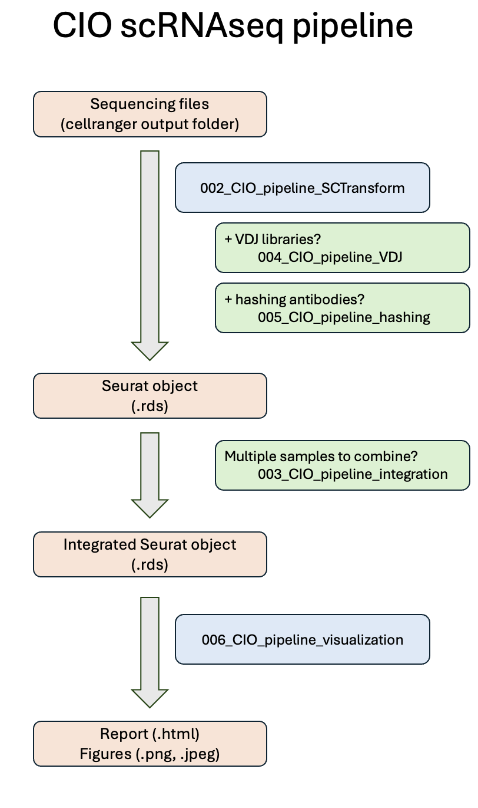

# CIO scRNAseq pipeline

## Accessing the pipeline on Biowulf:
**1.** Go to the HPC OnDemand website and request a Graphical Session.  

**2.** Open a terminal in the graphical session and allocate an sinteractive job:  
*sinteractive --nodes=1 --cpus-per-task=8 --mem=100G --gres=lscratch:200*

**3.** Load the module with these two commands:  
*module use --append /data/NCI-CIO/scRNAseq-app/modulefiles*  
*module load scRNAseq-app*  

**4.** Start RStudio using the wrapper:   
*app-rstudio* 

## Process to run scripts

